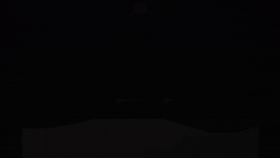

# CV-RL LunarLander

Проект про посадку LunarLander, где агент не получает состояние среды напрямую.
Вместо этого симулятор отдает RGB-кадр, CV-модель восстанавливает по нему state,
а RL-агент учится управлять посадкой уже по этому предсказанному состоянию.

Идея проекта — собрать небольшой end-to-end pipeline на стыке computer vision и
reinforcement learning: от генерации кадров и обучения CV-регрессора до обучения
RL-агента и визуализации его поведения.

<p align="center">
  
</p>

## Что внутри

- генерация изображений LunarLander и разметки состояния;
- обучение CV-моделей для восстановления state по кадру;
- несколько вариантов target state для CV-модели через `data/cv_integrations/`;
- Gymnasium wrapper, который подменяет observation на CV-derived state;
- обучение RL-агента через Stable-Baselines3 DQN;
- сохранение GIF-эпизодов и графиков во время обучения.

## Установка

```bash
python -m pip install -r requirements.txt
python -m pip install -e .
```

Для `LunarLander-v3` используется Box2D. Если установка Gymnasium с Box2D падает,
скорее всего не хватает системных build tools.

## Данные

Кадры и метки генерируются локально. Основные артефакты:

```text
data/images/      # RGB-кадры симулятора
data/labels.csv   # значения state для кадров
```

Ноутбуки для генерации и экспериментов лежат в `notebooks/`.

## Обучение CV-модели

Пример обучения ResNet18 для предсказания `x`, `y` и `theta`:

```bash
python train_cv.py \
  --integration x_y_theta \
  --model-type resnet18 \
  --version resnet18_pose \
  --epochs 20 \
  --batch-size 32 \
  --device cpu
```

Результаты сохраняются в `checkpoints/cv/<version>/`.

Доступные варианты CV-моделей:

- `resnet18`
- `simple-cnn`

## Обучение RL-агента

Пример запуска DQN-агента с CV-моделью:

```bash
python train_rl.py \
  --cv-weights checkpoints/cv/resnet18_pose/state_regressor_resnet18.pth \
  --cv-model-type resnet18 \
  --cv-metadata data/cv_integrations/x_y_theta/metadata.json \
  --save-path checkpoints/rl/sb3_dqn/models/dqn_vision_lander.zip \
  --timesteps 1000000 \
  --seed 42 \
  --device cpu \
  --obs-mode hybrid
```

Режимы observation:

- `hybrid` — CV-модель предсказывает доступные компоненты state, а недостающие
  компоненты берутся из Gymnasium. Это более устойчивый режим для обучения.
- `cv-only` — observation строится только из предсказаний CV-модели. Этот режим
  честнее с точки зрения CV-RL, но заметно сложнее для агента.

## Визуализация обучения

Чтобы сохранять GIF-эпизоды и график reward во время обучения, добавьте
`--visualize`:

```bash
python train_rl.py \
  --cv-weights checkpoints/cv/resnet18_pose/state_regressor_resnet18.pth \
  --cv-model-type resnet18 \
  --cv-metadata data/cv_integrations/x_y_theta/metadata.json \
  --save-path checkpoints/rl/sb3_dqn/models/dqn_vision_lander.zip \
  --timesteps 1000000 \
  --seed 42 \
  --device cpu \
  --obs-mode hybrid \
  --visualize \
  --vis-freq 50000
```

Визуализации и логи сохраняются в `runs/`.

## Оценка

```bash
python evaluate_rl.py \
  --cv-weights checkpoints/cv/resnet18_pose/state_regressor_resnet18.pth \
  --cv-model-type resnet18 \
  --cv-metadata data/cv_integrations/x_y_theta/metadata.json \
  --model-path checkpoints/rl/sb3_dqn/models/dqn_vision_lander.zip \
  --episodes 20 \
  --seed 100 \
  --device cpu \
  --obs-mode hybrid
```

Скрипт выводит reward по эпизодам, средний reward, стандартное отклонение и
количество успешных посадок.

## Замечания

Качество RL-агента сильно зависит от точности CV-модели. Если CV-модель плохо
восстанавливает положение или угол аппарата, агент будет учиться на шумном
state. Поэтому обычно имеет смысл сначала проверить CV-регрессию отдельно, а
уже потом запускать длинное RL-обучение.
