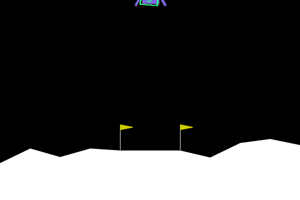

# CV-RL LunarLander

Проект про посадку LunarLander, где агент не получает состояние среды напрямую.
Вместо этого симулятор отдает RGB-кадр, CV-модель восстанавливает по нему state,
а RL-агент учится управлять посадкой уже по этому предсказанному состоянию.

Идея проекта — собрать небольшой end-to-end pipeline на стыке computer vision и
reinforcement learning: от генерации кадров и обучения CV-регрессора до обучения
RL-агента и визуализации его поведения.


<p align="center">
  
</p>

## Что внутри

- генерация изображений LunarLander и разметки состояния;
- обучение CV-моделей для восстановления state по кадру;
- несколько вариантов target state для CV-модели через `data/cv_integrations/`;
- Gymnasium wrapper, который подменяет observation на CV-derived state;
- обучение RL-агента через Stable-Baselines3 DQN или PPO;
- сохранение GIF-эпизодов и графиков во время обучения.

## Установка

```bash
python -m pip install -r requirements.txt
python -m pip install -e .
```

Для `LunarLander-v3` используется Box2D. Если установка Gymnasium с Box2D падает,
скорее всего не хватает системных build tools.

## Данные

Кадры и метки генерируются локально. Основные артефакты:

```text
data/images/      # RGB-кадры симулятора
data/labels.csv   # значения state для кадров
```

Ноутбуки для генерации и экспериментов лежат в `notebooks/`.

## Обучение CV-модели

Пример обучения ResNet18 для предсказания `x`, `y` и `theta` через Hydra-конфиг:

```bash
python train_cv.py \
  data.integration=x_y_theta \
  model.type=resnet18 \
  output.version=resnet18_pose \
  train.epochs=20 \
  train.batch_size=32 \
  device=cpu
```

Базовые настройки лежат в `configs/cv/train.yaml`.
Для функции потерь используйте `loss.type`: доступны `mse`, `smooth_l1` и `l1`.

Результаты сохраняются в `checkpoints/cv/<version>/`.

Доступные варианты CV-моделей:

- `resnet18`
- `efficientnet-b0`
- `simple-cnn`

## Обучение RL-агента

Пример запуска DQN-агента с CV-моделью через Hydra-конфиг:

```bash
python train_rl.py \
  cv.weights=checkpoints/cv/resnet18_pose/state_regressor_resnet18.pth \
  cv.model_type=resnet18 \
  cv.metadata=data/cv_integrations/x_y_theta/metadata.json \
  output.save_path=checkpoints/rl/sb3_dqn/models/dqn_vision_lander.zip \
  rl.timesteps=1000000 \
  seed=42 \
  device=cpu \
  env.obs_mode=hybrid
```

Базовые настройки лежат в `configs/rl/train.yaml`.

Для PPO есть отдельный конфиг:

```bash
python train_rl.py --config-name train_ppo \
  cv.weights=checkpoints/cv/resnet18_pose/state_regressor_resnet18.pth \
  cv.model_type=resnet18 \
  cv.metadata=data/cv_integrations/x_y_theta/metadata.json \
  output.save_path=checkpoints/rl/sb3_ppo/models/ppo_vision_lander.zip \
  rl.timesteps=1000000 \
  device=cpu \
  env.obs_mode=hybrid
```

Режимы observation:

- `hybrid` — CV-модель предсказывает доступные компоненты state, а недостающие
  компоненты берутся из Gymnasium. Это более устойчивый режим для обучения.
- `cv-only` — observation строится только из предсказаний CV-модели. Этот режим
  честнее с точки зрения CV-RL, но заметно сложнее для агента.

## Визуализация обучения

<p align="center">
  
</p>

Чтобы сохранять GIF-эпизоды и график reward во время обучения, включите
`visualization.enabled`:

```bash
python train_rl.py \
  cv.weights=checkpoints/cv/resnet18_pose/state_regressor_resnet18.pth \
  cv.metadata=data/cv_integrations/x_y_theta/metadata.json \
  output.save_path=checkpoints/rl/sb3_dqn/models/dqn_vision_lander.zip \
  rl.timesteps=1000000 \
  seed=42 \
  device=cpu \
  env.obs_mode=hybrid \
  visualization.enabled=true \
  visualization.overlay_cv_pose=true \
  visualization.freq=50000
```

Визуализации и логи сохраняются в `runs/`. `visualization.overlay_cv_pose=true`
рисует зелёный контур корпуса по выбранному источнику `x`, `y` и `theta`.
По умолчанию используется CV-предсказание (`visualization.overlay_pose_source=vision`).
Для демонстрационной GIF можно использовать реальный state с небольшим шумом:

```bash
python train_rl.py \
  load.path=checkpoints/rl/sb3_dqn/periodic/dqn_vision_lander_1m_600000_steps.zip \
  output.save_path=runs/readme_noisy_true_pose/tmp_dqn.zip \
  visualization.dir=runs/readme_noisy_true_pose \
  visualization.enabled=true \
  visualization.overlay_cv_pose=true \
  visualization.overlay_pose_source=true-noisy \
  'visualization.overlay_noise_std=[0.01,0.01,0.045]' \
  visualization.freq=1000000 \
  rl.timesteps=1 \
  checkpoint.freq=0 \
  replay_buffer.save=false
```

## Оценка

```bash
python evaluate_rl.py \
  cv.weights=checkpoints/cv/resnet18_pose/state_regressor_resnet18.pth \
  cv.model_type=resnet18 \
  cv.metadata=data/cv_integrations/x_y_theta/metadata.json \
  model.algorithm=dqn \
  model.path=checkpoints/rl/sb3_dqn/models/dqn_vision_lander.zip \
  evaluation.episodes=20 \
  seed=100 \
  device=cpu \
  env.obs_mode=hybrid
```

Базовые настройки оценки лежат в `configs/rl/evaluate.yaml`. Для PPO можно
использовать `--config-name evaluate_ppo` или явно передать
`model.algorithm=ppo`.

Скрипт выводит reward по эпизодам, средний reward, стандартное отклонение и
количество успешных посадок.

## Замечания

Качество RL-агента сильно зависит от точности CV-модели. Если CV-модель плохо
восстанавливает положение или угол аппарата, агент будет учиться на шумном
state. Поэтому обычно имеет смысл сначала проверить CV-регрессию отдельно, а
уже потом запускать длинное RL-обучение.
